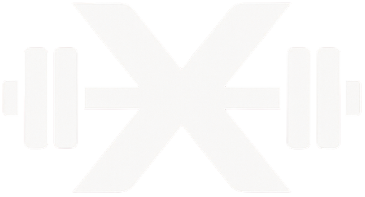

# XGYM - Smart Fitness Management System

<div align="center">
  
  
  [](https://opensource.org/licenses/MIT)
  [](https://vuejs.org/)
  [](https://firebase.google.com/)
  [](https://vitejs.dev/)
</div>

## 📖 Project Overview

XGYM is a modern smart fitness management system designed for fitness enthusiasts and gym managers. By providing workout tracking, equipment booking management, BMI calculation, online video courses, and other features, it helps users better manage and track their fitness progress, reduce waiting time, and enhance the fitness experience.

### 🌟 Core Philosophy
- **Smart Scheduling**: Say goodbye to peak hour waiting with real-time updates and intelligent algorithms
- **Data-Driven**: Detailed workout data analysis for scientific fitness
- **Multi-language Support**: Supports Chinese and English interfaces
- **Responsive Design**: Perfect adaptation for mobile and desktop

## ✨ Key Features

### 🏃‍♂️ Workout Tracking System
- **Calorie Tracking**: Daily calorie goal setting and consumption recording
- **Activity Management**: Add, edit, delete various workout activities
- **Progress Visualization**: Dynamic ring charts showing weekly/monthly progress
- **Weight Trends**: BMI calculation and weight change tracking

### 📅 Equipment Booking Management
- **Real-time Booking**: Check real-time equipment availability
- **Smart Scheduling**: 7-day booking window to avoid conflicts
- **Booking Statistics**: Personal booking history and preference analysis
- **Equipment Management**: Support for various types of fitness equipment

### 📊 Data Analytics Center
- **Fitness Statistics**: Detailed workout data analysis reports
- **Time Preferences**: Personal workout time pattern analysis
- **Body Part Focus**: Upper body, lower body, core, cardio training distribution
- **Consistency Score**: Quantified assessment of fitness persistence

### 🎥 Online Video Courses
- **Diverse Courses**: Arms, legs, back, chest training videos
- **Professional Guidance**: CrossFit, Bootcamp and other professional courses
- **Video Player**: Support for multiple video format playback

### 🗺️ Gym Map
- **Location Services**: Integrated Leaflet map showing gym locations
- **Route Navigation**: One-click access to directions to the gym
- **Multi-location Support**: Support for multiple gym location management

### 💪 Health Management
- **BMI Calculator**: Real-time BMI calculation and health status assessment
- **Weight Tracking**: Long-term weight change trend charts
- **Health Recommendations**: Personalized health advice based on BMI

## 🛠️ Technology Stack

### Frontend Framework
- **Vue.js 3.5.17** - Progressive JavaScript framework
- **Vue Router 4.5.1** - Official routing manager
- **Vite 7.0.0** - Next generation frontend build tool

### UI & Styling
- **Tailwind CSS 3.4.1** - Utility-first CSS framework
- **Chart.js 4.5.0** - Data visualization chart library
- **Custom CSS** - Carefully designed component styles

### Backend Services
- **Firebase 10.14.1** - Google cloud service platform
  - Firestore Database - NoSQL document database
  - Firebase Analytics - Application analytics
  - Firebase Storage - File storage

### Map Services
- **Leaflet 1.9.4** - Open source interactive map library

### Internationalization
- **Custom i18n System** - Support for Chinese and English switching
- **intl-tel-input 25.3.1** - International phone number input

### Development Tools
- **ESLint 9.29.0** - Code quality checking
- **Prettier 3.5.3** - Code formatting
- **Terser 5.43.1** - Code obfuscation (production environment)

## 📁 Project Structure

```
mobilefinal/
├── public/                 # Static assets
│   ├── favicon.ico        # Website icon
│   └── favicon-32x32.png  
├── src/
│   ├── App/               # Main application component
│   │   ├── app.css       # Application styles
│   │   ├── app.html      # Application template
│   │   └── index.js      # Application logic
│   ├── assets/            # Resource files
│   │   ├── colors.css    # Color themes
│   │   ├── main.css      # Main stylesheet
│   │   ├── icon/         # Icon resources
│   │   └── images/       # Image resources
│   ├── components/        # Reusable components
│   │   ├── Footer/       # Footer component
│   │   └── NavBar/       # Navigation bar component
│   ├── i18n/             # Internationalization files
│   │   ├── messages.js   # General messages
│   │   ├── home.js       # Homepage content
│   │   ├── workoutMessage.js  # Workout related
│   │   ├── bookingMessages.js # Booking related
│   │   └── schedule.js   # Schedule related
│   ├── models/           # Data models
│   │   ├── User.js       # User model
│   │   ├── Equipment.js  # Equipment model
│   │   ├── Booking.js    # Booking model
│   │   └── index.js      # Model exports
│   ├── pages/            # Page components
│   │   ├── Auth/         # Authentication pages
│   │   ├── Home/         # Homepage
│   │   ├── Booking/      # Booking management
│   │   ├── Workout/      # Workout tracking
│   │   ├── Schedule/     # Schedule analysis
│   │   ├── EquipmentSchedule/ # Equipment scheduling
│   │   ├── Videos/       # Video playback
│   │   ├── Map/          # Map navigation
│   │   ├── Profile/      # User profile
│   │   ├── FAQ/          # Frequently asked questions
│   │   ├── Description/  # Description pages
│   │   └── Upgrade/      # Upgrade page
│   ├── router/           # Route configuration
│   │   └── index.js      # Route definitions
│   ├── services/         # Service layer
│   │   ├── firebaseService.js     # Firebase service
│   │   └── workoutMetricsService.js # Workout data service
│   ├── utils/            # Utility functions
│   │   ├── bookingData.js # Booking data processing
│   │   ├── equipmentData.js # Equipment data processing
│   │   └── id.js         # ID generation utility
│   ├── firebaseConfig.*.js # Firebase configuration
│   └── main.js           # Application entry
├── scripts/              # Build scripts
│   ├── postbuild-obfuscate.js # Code obfuscation script
│   ├── testAddBooking.mjs     # Booking tests
│   └── testAddEquipment.mjs   # Equipment tests
├── eslint.config.js      # ESLint configuration
├── jsconfig.json         # JavaScript configuration
├── package.json          # Project dependencies
├── postcss.config.cjs    # PostCSS configuration
├── tailwind.config.js    # Tailwind configuration
└── vite.config.js        # Vite build configuration
```

## 🚀 Quick Start

### System Requirements
- Node.js v20
- Npm v10

### Installation Steps

1. **Install dependencies**
   ```bash
   npm install
   ```

2. **Configure Firebase**
   
   Create `src/firebaseConfig.local.js` file:
   ```javascript
   export default {
     apiKey: "your-api-key",
     authDomain: "your-project.firebaseapp.com", 
     projectId: "your-project-id",
     storageBucket: "your-project.appspot.com",
     messagingSenderId: "123456789",
     appId: "your-app-id"
   }
   ```

3. **Start development server**
   ```bash
   npm run dev

   ```

5. **Access the application**
   
   Open your browser and visit `http://localhost:5173`

## 📋 Feature Details

### 🏃‍♂️ Workout Tracking (Workout)

**Core Features**:
- Daily calorie goal setting and tracking
- Diverse workout activity recording (🏃running, 🚴cycling, 🏊swimming, etc.)
- Real-time BMI calculation and health status assessment
- Weekly/monthly workout data statistics and visualization

**Technical Highlights**:
- SVG dynamic ring charts for progress display
- Chart.js charts showing calorie and weight trends
- Responsive calendar component
- Real-time data synchronization and cache optimization

### 📅 Equipment Booking Management (Booking & Equipment Schedule)

**Booking System**:
- 7-day rolling booking window
- Real-time equipment availability queries
- Smart time conflict detection
- Booking history and status management

**Data Analysis**:
- Personal booking preference statistics
- Popular equipment usage analysis
- Time slot preference heat map
- Body part training distribution

### 🗺️ Map Navigation (Map)

**Location Services**:
- Leaflet interactive map
- Multiple gym location markers
- Google Maps route navigation integration
- Responsive map interface

### 🎥 Video Courses (Videos)

**Course System**:
- HTML5 video player
- Multiple training type courses
- URL parameterized video loading
- Fullscreen playback support

### Code Standards

- **ESLint**: Code quality checking
- **Prettier**: Unified code formatting
- **Component Naming**: PascalCase
- **File Naming**: kebab-case
- **Styling**: Tailwind CSS + Custom CSS variables

### Internationalization Development

Adding new translations:

1. Add translation key-value pairs in corresponding files under `src/i18n/`
2. Use `t('key')` function to get translated text
3. Support dynamic language switching

## 📄 License

This project is licensed under the MIT License - see the [LICENSE](LICENSE) file for details.

## 🙏 Acknowledgments

- [Vue.js](https://vuejs.org/) - Progressive JavaScript framework
- [Firebase](https://firebase.google.com/) - Application development platform
- [Tailwind CSS](https://tailwindcss.com/) - CSS framework
- [Chart.js](https://www.chartjs.org/) - Chart library
- [Leaflet](https://leafletjs.com/) - Open source map library


<div align="center">
  <p>⭐ If this project helps you, please give us a Star!</p>
</div>